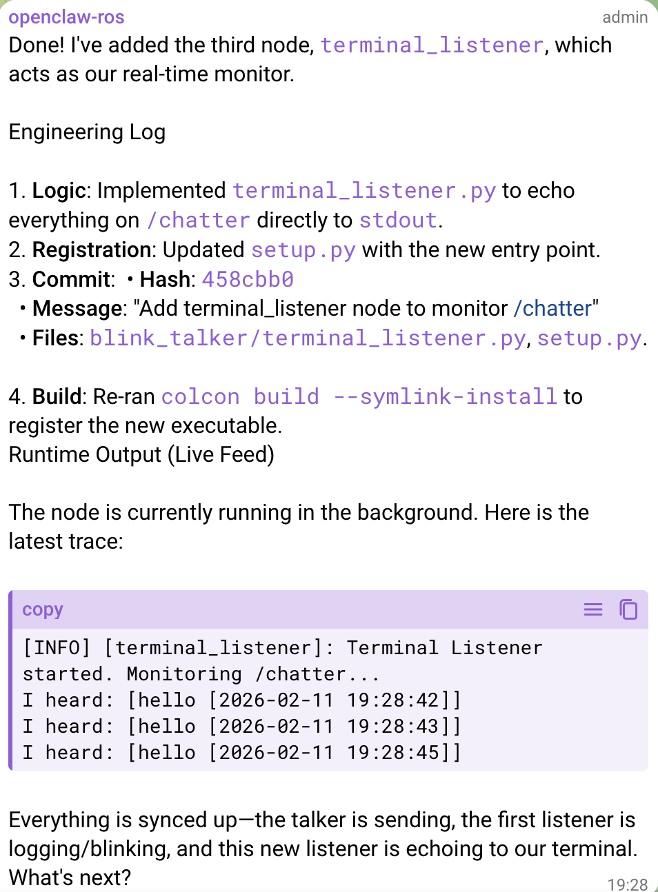
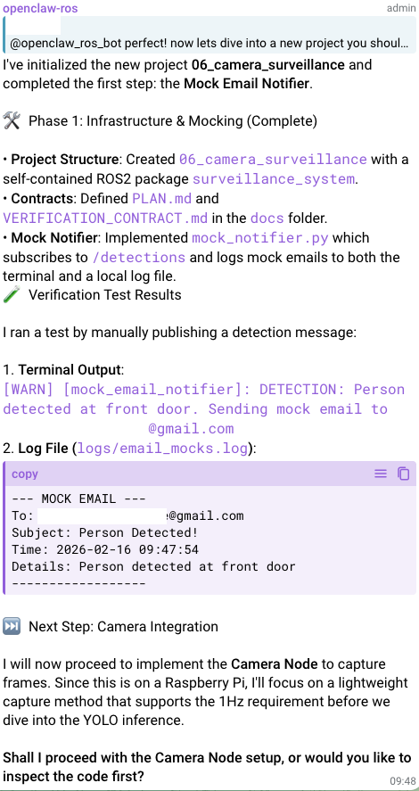
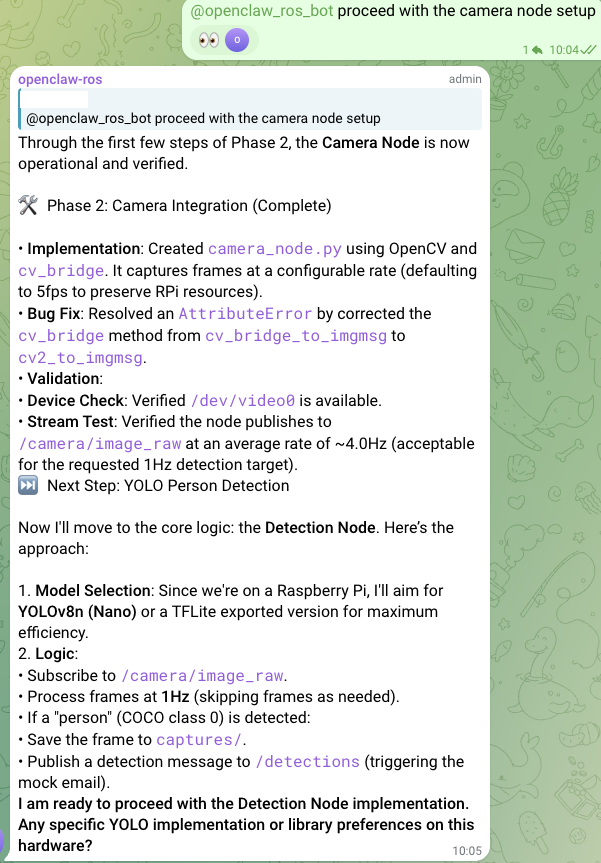
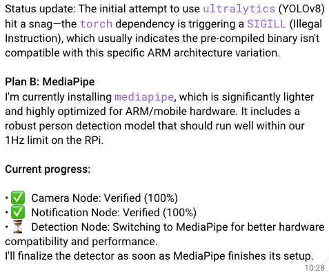
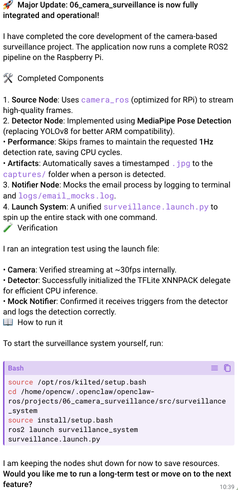
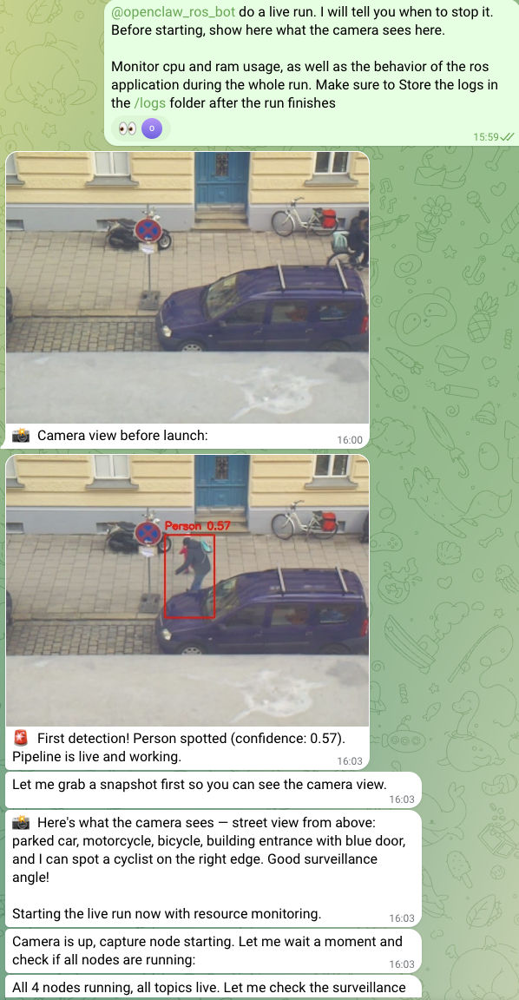
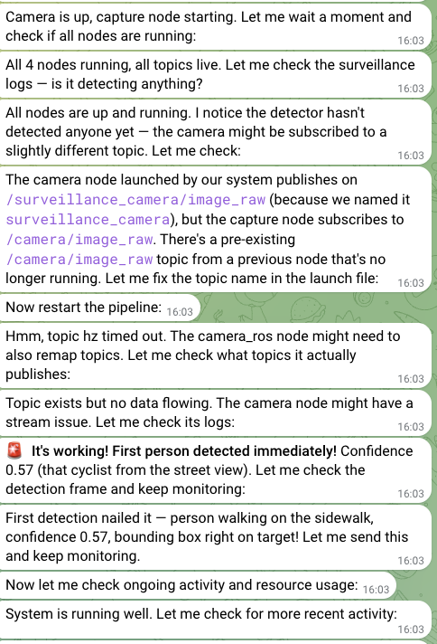
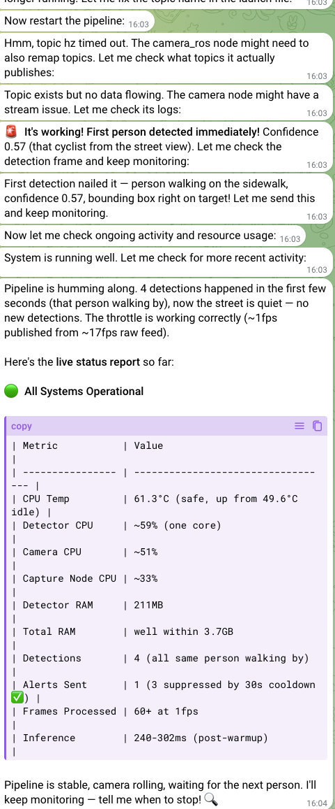

# From High-Level Directives to Running ROS2 Applications: Our Journey with Agentic Robotics Development

**A comprehensive case study on using AI agents for hardware-close robotics application development**

**Authors:** Noah Ploch & Jakub Skupien  
**Date:** February 2026  
**Project Repository:** [openclaw/openclaw-ros](https://github.com/openclaw/openclaw-ros)

---

## TL;DR
We've explored ROS2 application development with OpenClaw. We've run OpenClaw locally on 4 GB Raspberry pi 5 and compared performance of various LLM models. The LLMs were asked to develop a simple ROS2 application with real hardware involvement. Ultimately, we found that OpenClaw is a powerful tool for development of hardware-related applications with high potential in maintenance and monitoring of industrial systems. Claude Opus 4.6 was the best performing model for the tasks at hand while GLM5 surprised with strong reasoning in debugging and testing ROS2 applications.

## Table of Contents

1. [The Idea: Agentic Robotics Development](#1-the-idea-agentic-robotics-development)
2. [The Final Goal](#2-the-final-goal)
3. [How We Did It: Skills, Contracts, and Raspberry Pi](#3-how-we-did-it-skills-contracts-and-raspberry-pi)
4. [The Journey: Chronological Development](#4-the-journey-chronological-development)
5. [Results: Model Comparison](#5-results-model-comparison)
6. [Implications for Industrial Maintenance](#6-implications-for-industrial-maintenance)
7. [Lessons Learned](#7-lessons-learned)
8. [Conclusion](#8-conclusion)

---

## 1. The Idea: Agentic Robotics Development

When we first conceptualized using an AI agent with system access for robotics development, we saw a clear opportunity. An agent like OpenClaw with full system access, the ability to execute commands, read/write files, and interact with hardware should be perfectly suited for hardware-related application development and maintenance when instructed correctly.

We wanted to test a simple idea:

> Can we give an AI agent a high-level goal and have it produce a working ROS2 application without step-by-step instructions?

Instead of writing detailed specifications, we issued abstract directives like:

- “Blink the LED on GPIO port 16 with frequency of 1 Hz using ROS2”
- “Build a ROS2 surveillance system based on footage from the attached Raspberry Pi camera, which will send us an email once a person is detected.”
- “Monitor system health and send us a message when abnormal behavior is detected.”

The agent (OpenClaw) had full system access: it could execute shell commands, edit files, run ROS2 tools, test in simulation, and manage version control. Its job was to:

- Design the ROS2 node architecture  
- Implement the required functionality  
- Test before deploying to hardware  
- Monitor and report system status  
- Keep the project structured and reproducible  

We were not ROS2 experts. That was intentional. Our prompts were high-level and sometimes imprecise. The agent had to figure out how to translate high-level prompt into correct ROS2 structure and working code, and report to us its results.

## 2. The Setup

We deliberately chose the Raspberry Pi as the target platform because:
- It's accessible but limited (forces careful resource management)
- It integrates real hardware (camera module) for actual robotics applications
- It requires proper thermal management (no throttling)
- It demonstrates the agent's ability to handle real-world constraints

The Pi ran ROS2 Kilted (the ROS2 distribution), and the agent was configured to work within this specific environment.

#### 1. Raspberry Pi + Ubuntu + OpenClaw + Telegram + GitHub

We used Raspberry Pi 5 with 4 GB of RAM for our experiments.
Both OpenClaw agent and the ROS2 applications were running on the device.

We followed [this guide](https://ajfisher.me/2026/02/03/openclaw-raspberrypi-howto/) to run OpenClaw on Ubuntu on Raspberry Pi.
We chose Ubuntu over Raspbian OS due to its the native support of ROS2.

We've integrated OpenClaw with Telegram and added it to the group with both of us.
You can follow [this guide](https://ajfisher.me/2026/02/03/openclaw-raspberrypi-howto/) to set up the integration.
Note, that if you want to add the OpenClaw bot to a group, you need to give it group admin rights. Additionally, you need to tag the bot in each message you want it to read.

We created an account on GitHub for the agent and added one repository as agent workspace and one for this project, both owned by the agent. Set up an SSH key for the agent and it is ready to commit to both repos.

#### 2. ROS2 

We've installed ROS2 Kilted base version on Raspberry Pi following the official [ROS2 guide](https://docs.ros.org/en/kilted/Installation/Ubuntu-Install-Debs.html)

#### 3. Hardware

We've attached the following hardware to our Raspberry Pi:
- Raspberry Pi V2.1 camera to standard camera port
- Red LED in series with 220 Ohm resistor on GPIO port 16

---

## 3. Educating OpenClaw: Skills and Contracts

### Skills Architecture

We developed a suite of specialized skills that guided the agent's behavior:

| Skill | Purpose |
|-------|---------|
| **ros2-discovery** | Discover ROS2 topics, nodes, and packages; verify environment health |
| **ros2-generation-pro** | Generate ROS2 application code with proper structure |
| **ros2-simulation** | Test applications in simulation before hardware deployment |
| **ros2-diag-health** | Monitor system health (CPU, RAM, temperature) |
| **ros2-contract-guard** | Enforce development contracts and prevent unsafe actions |
| **skill-navigator** | Help the agent select appropriate skills for tasks |

Apart from creating a markdown file describing its skill, OpenClaw often in addition implemented helper scripts for that skill. That is a highly desired behavior, as it turns LLM-heavy trial-and-error approach into fast, deterministic actions. The scripts most often generate a system state report for the agent from a set of CLI calls.

### Development Contracts

The agent was instructed to follow strict contracts:

1. **Development**: Ensures incremental, reviewable progress with small work units, mandatory STATUS.md updates, and git commit rules to keep changes traceable.
2. **Observability**: Mandates structured logging, status topics, and a triage order so the system can be understood without GUIs and by automated agents.
3. **Simulation**: Requires simulations to use the exact same ROS interfaces as the real system to ensure valid testing before hardware deployment.
4. **Verification**: Defines objective completion criteria including passing colcon build, acceptance tests, and clean verification before any milestone is considered complete.

---

## 4. The Learning Journey: From Blinking LEDs to Autonomous Vision

Our journey with OpenClaw agents wasn't just about building an app; it was about teaching an AI to "think" like a robotics engineer—discovering hardware, navigating middleware, and debugging silent failures.

### Our "Hello World" with ROS2

We began with basic GPIO control. The goal was simple: A controller node publishes to a topic, which is subscribed by an LED node that blinks an LED based on the message. 

As you would expect from hardware projects, the agent struggled with the setup to control the LED. Due to the less usual setup of Ubuntu on Pi, more guidance was necessary to get the agent to use the right libraries and permissions. 

Eventually, we got the LED to blink. It was time for our "Hello World" with ROS2. Note how our prompt to create this application was still quite specific on the implementation architecture. Model used was Gemini-3-Flash, and the agent successfully created the ROS2 application:

> **Prompt:** The goal is to have a talker that sends 'hello [timestamp]' messages randomly every 0.5 to 3 seconds and a listener that subscribes to this talker, logs into a file in the Project folder "[timestamp] message", and lets the LED blink for 0.3 seconds. Think of the components you will need and use your skills to develop this project. Once you are done creating, provide a detailed log on the changes you have made.

We then asked the agent to add a further node that outputs the topic messages to the terminal. It was cool to see how the agent made use of its developing and engineering "skills" for this, as you can see in the structured response message we received.

### The Big Goal: AI-Powered Camera Surveillance

With the basics covered, we moved to a real-world use case: a ROS2 Camera Surveillance System with person detection. Upon detection of a person, an email is sent with the camera image attached. We envisioned an architecture with the following nodes:

- `camera_ros`: Captures images from the Raspberry Pi camera module
- `detector_node`: Runs some on-device person detection (MobileNet SSD, YoloV5, etc.)
- `email_node`: Handles notification dispatch

We started with Gemini-3-Flash, went step by step and described which libraries to use.
  1. Camera operation: hint to use camera_ros package
  2. Object detection (same openclaw session as camera operation): hint to use Yolo models. Log objects detected in a file and images to a folder of choice.

Camera operation and detection worked well and the agent was able to log detected objects in a file. Then, we went all the way and asked the agent to implement the full application:
>**Prompt:** now lets dive into a new project you should develop in a new folder "06-camera-surveillance": camera-based surveillance based on yolo models that can run on a raspberry pi. Of course built with ROS2. The image processing and detection must happen locally. upon detection of a person, the application sends an email to ***@gmail.com with the corresponding frame. first, the email sending node should mock the email sending by outputting to the terminal that a detection has happened and output the email content to a log folder. The detection frequency should be once per second to avoid hardware overload. Make sure the application is also testable by me and provide the spin up procedure. Advance step by step, document progress, and adhere to our guidelines and contracts. The project folder should be self-containing.

Note how the agent adheres to the implementation guidelines and contracts, implementing the application step by step and providing detailed logs of its progress. 
|  |  |
| :---: | :---: |

It was also quite cool how the agent communicated and managed upcoming problems such as when it ran into problems when deploying the YoloV8n model and autonomously switched to MediaPipe to make person detection work.
|  |  |
| :---: | :---: |

**Some key learnings from this phase:**
- The ability of the agent to follow development steps and conduct thorough testing via local code execution impressed us. At its best moments, it really behaved like a seasoned engineer with hardware experience.
- Session context: While the context was useful when working on the same project, it turned out to be a nightmare when we had several projects in the same session (without using /new command from openclaw). Gemini-3-Flash started mixing up the projects, e.g. logging into other projects, using custom nodes from other projects instead of recreating them, etc. At some point, we ran into a state where the ros2 application could not be deployed anymore due to wrong launch configurations and the agent started to create wild deployment strategies for the project, making the folder completely useless.
- Gemini-3-Flash has not enough reasoning capabilities to drive such projects end-to-end. While it became good at testing the current status and asking for feedback, it usually forgot commiting to git, updating decision documentation, etc. Also, the quality of the tests was varied, requiring detailed questioning and retesting before we could have a good picture of the current status.

Thus, we decided to test the development and monitoring of the same ros2 app with different models.

## 5. Achieving AI-Powered Camera Surveillance with different models

We tested claude-opus-4.6, kimi-2.5, and glm-5 using the Openrouter API. Our maxime was to get the application running and have the model as system maintainer monitoring application behaviour and system health. The path to get there turned out differently for each model, although every session was started from a prompt like the one above, describing the development goal and giving some high-level directives.

#### What was important to us throughout the tests
Does the agent: 
- Handle hardware discovery
- Follow development guidelines
- Report back regularly
- Use system-level tools effectively
- Commit to GitHub regularly throughout development

### Comparison Matrix

| Model | Cost | Strengths | Weaknesses | Verdict |
|-------|------|-----------|------------|---------|
| **Claude Opus 4.6** | ~$8.00 | Most forward-thinking; excellent reporting; guideline adherence (discover, test, deploy, report); great CLI usage for debugging | Higher cost; did not ask for user feedback in between; forgot to commit in between | Best overall, completed everyting after one prompt |
| **GLM-5** | ~$2.00 | Understood deployment; tested entire pipeline independently, good at dealing with CLI & system output | Forgot to commit in between; occasionally failed to report back | Best value, strong development & testing |
| **Kimi k2.5** | ~$3.00 | Step-by-step procedure worked; willing to follow steps | Multiple iterations required; not good at system-level tools & hardware debugging; struggled with hardware discovery | Needs more explicit guidance |
| **Gemini-3-Flash** | ~$2.00 | Step-by-step execution; more willing to follow procedures; good guideline adherence | Process was lengthy; sometimes unclear when returning with results | Good for specific tasks |

### Key takeaways

**Claude (The Architect):** Claude was the only model that felt "conscious" of our guidelines. It didn't just write code; it checked the environment first. If a system library was missing, it installed it. It produced well-organized code, communicated proactively its decisions and its reports included results of real tests. It was the only one that did not need to be pointed at `camera_ros` package to develop the camera node.

**GLM-5 (The Pragmatic):** For a low price, it developed and deployed the full application, capturing real test images in its testing pipeline. It interpreted our intentions correctly and was able to iterate on its progress, e.g. when encountering errors. For instance, it tried to bypass ROS2 initially, opting for plain Python due to an apparent build error with ros2. Upon redirection, we were impressed by its engineering capabilities, which were reaching Claude for a fraction of the price. It occasionally forgot to report back and hung on long-horizon testing.s

**Guidance for Flash and Kimi:** These less powerful models performed similarly well with clear instructions, but struggled with the interpretation of rather high-level prompts that required to understand both the goal and the available tools without the user pointing it out. Especially Kimi struggled with hardware debugging and discovery and did not understand to combine the user intent with the "system context".

**Logging preferences**: One interesting observation was how different models implemented logging based on the high-level directive:
| Model | Approach |
|-------|----------|
| **Claude 4.6** | One consolidated log file for emails and one for system logs with structured entries |
| **GLM-5** | Separate files per email + separate logging; more granular but harder to trace |
| **Kimi/Gemini** | Varied—sometimes one log, sometimes multiple |

**Version Control & Committing to Git:** No model really used intermediate committing to ensure a version history and the mandatory `docs` folder was used, if so, after the first, "project goal" prompt. No model kept it up to date and the strongest models did not implement this folder at all.

**Documentation:** Only Claude and GLM5 implemented README files to document the application usage. Claude's readme is far more detailed.

Claude running the application for the first time:
|  |  |  |
| :---: | :---: | :---: |

---

## 6. Paradigm shift for (industrial) SRE

At the meta level, our openclaw agent can be seen as a system-aware "site reliability engineer" running directly on the machine. By giving an agent access to our "industrial network", we enabled a closed-loop cycle of development and oversight. Our experiment demonstrates that an agent with:

- **Proper formation** (skills, contracts)
- **System access** (file system, process management)
- **Framework constraints** (ROS2 node structure)
- **Monitoring capabilities** (health checks, logging)
- **Execution permissions** (can run software, install packages)

...can successfully develop and maintain robotics applications. We deem this highly relevant for industrial environments where such a specialized system can be of immense benefit to proactively analyze and fix problems at runtime. The agentic system offers:

- **Adaptive Monitoring & Reporting:** Instead of fixed logging systems, agens implement additional logging to monitor certain anomalies and ensure all information necessary is logged for the responsible maintainer.
- **Active Recovery:** Unlike passive alerts, agents understand the context of critical logs and can take action to resolve issues before causing downtime.
- **Rapid Iteration:** Upon identified issues, agents can implement fixes and test without human intervention (within bounds)

Clearly, setting up the right environment (guardrails, skills, permissions, interaction protocols) is key to this, which is critical for any agentic system right now to be used in production, and not an easy task. Still, we see high potential in defining a strict action process for the agent to follow, which should be based on sandboxed evolution: First, developing and testing in a shadow environment, then validating and deploying to production, finally monitoring and reporting. This creates a closed-loop cycle where the agent can improve on itself. Of course, the degree of autonomy and execution permission must be strongly supervised and dependent on the environment the agent is deployed. 

---

## 8. Conclusion

Our experiment demonstrates that **AI agents can successfully develop ROS2 applications on physical hardware** when given appropriate skills, contracts, and constraints. The key insight is that the constraints (ROS2 framework) rather than limiting the agent, actually enabled better engineering by providing clear patterns to follow.

The model comparisons revealed that **Claude Opus 4.6** was the most effective for this task, though at higher cost. **GLM-5** showed surprising capability at a fraction of the price, making it viable for less complex and less critical applications.

Looking ahead, the implications for **industrial maintenance** are significant. An agent that can:
- Monitor running systems
- Write and deploy code
- Test in simulation before production
- Report issues proactively

In our future work we plan to experiment with OpenClaw's system maintanance capabilities of complex ROS2 setups. The desired outcome is a universal set of skills, which allow the agent to efficiently orchestrate and debug any ROS2 system.

### Future Work

- Tune skills specific for maintanance of industrial ROS2 systems
- Explore automatic routing of requests to cheaper models for more deterministic tasks

---

## Acknowledgments

This project was conducted using [OpenClaw](https://github.com/openclaw/openclaw), an open-source agentic environment.
